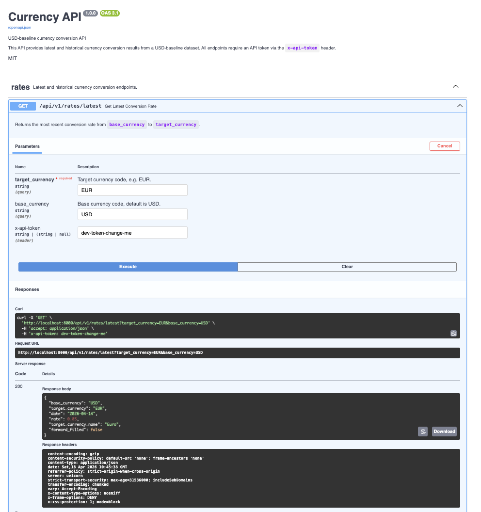

# Currency API (Demo)

FastAPI service for currency conversion using USD-baseline historical data.

Reference base project:
- https://github.com/ArjanCodes/examples/tree/main/2025/project

## Endpoints



All API endpoints require a plain API token header: `x-api-token`.

- `GET /api/v1/currencies`
  - Returns available currencies plus dataset metadata (`total_records`, `min_date`, `max_date`, `missing_records`, etc.).
- `GET /api/v1/rates/latest?target_currency=EUR&base_currency=USD`
  - Returns latest converted rate.
- `GET /api/v1/rates/historical?target_currency=EUR&base_currency=USD&date_from=2026-01-01&date_to=2026-04-01`
  - Returns a continuous daily series with forward-fill.
  - Response includes `forward_filled: true|false` per row.

## Notes

- Source data is USD-based; non-USD pairs are derived from available dataset rates.
- Historical output starts at the earliest real date available for the requested pair.
- `date_from` and `date_to` are required on the historical endpoint.
- Configure token with `API_AUTH_TOKEN` (defaults to `dev-token-change-me` for local dev only).
- Default rate limit is `5` requests/minute per client IP (`RATE_LIMIT_PER_MINUTE`).
- Dev mode uses persistent SQLite at `dev_data/currency.db`.
- Seed source file `tests/currencies.json` is read-only and never overwritten by the API.
- Docker image rebuilds reset DB state to seeded JSON because local DB files are excluded from build context via `.dockerignore`.

## Run Locally

```bash
uv run pytest -q
uv run uvicorn app.main:app --host 0.0.0.0 --port 8000
```

Docs:
- `http://localhost:8000/docs`
- `http://localhost:8000/redoc`

Example:

```bash
curl -sS "http://localhost:8000/api/v1/currencies" \
  -H "x-api-token: dev-token-change-me" | jq
```

Historical `GET` example:

```bash
curl -sS "http://localhost:8000/api/v1/rates/historical?target_currency=EUR&base_currency=USD&date_from=2026-01-01&date_to=2026-04-01" \
  -H "x-api-token: dev-token-change-me" | jq
```

Historical `POST` example:

```bash
curl -sS -X POST "http://localhost:8000/api/v1/rates/historical" \
  -H "Content-Type: application/json" \
  -H "x-api-token: dev-token-change-me" \
  -d '{"target_currency":"EUR","base_currency":"USD","date_from":"2026-01-01","date_to":"2026-04-01"}' | jq
```

Historical `PUT` example:

```bash
curl -sS -X PUT "http://localhost:8000/api/v1/rates/historical" \
  -H "Content-Type: application/json" \
  -H "x-api-token: dev-token-change-me" \
  -d '{"target_currency":"EUR","base_currency":"USD","date_from":"2026-01-01","date_to":"2026-04-01"}' | jq
```

Source record `PUT` example (create old record, year 2000):

```bash
curl -sS -X PUT "http://localhost:8000/api/v1/rates/source-record" \
  -H "Content-Type: application/json" \
  -H "x-api-token: dev-token-change-me" \
  -d '{"target_currency":"ZZZ","date":"2000-01-01","rate":2.5,"currency_name":"Legacy Test Currency"}' | jq
```

Update the same single record (change only the rate):

```bash
curl -sS -X PUT "http://localhost:8000/api/v1/rates/source-record" \
  -H "Content-Type: application/json" \
  -H "x-api-token: dev-token-change-me" \
  -d '{"target_currency":"ZZZ","date":"2000-01-01","rate":3.75,"currency_name":"Legacy Test Currency"}' | jq
```

Verify the updated value:

```bash
curl -sS "http://localhost:8000/api/v1/rates/historical?target_currency=ZZZ&base_currency=USD&date_from=2000-01-01&date_to=2000-01-01" \
  -H "x-api-token: dev-token-change-me" | jq
```

## Run with Docker

```bash
docker compose up --build -d
```

## Security Considerations

- Use a strong random `API_AUTH_TOKEN` in all non-local environments.
- Rotate API tokens regularly and immediately after suspected exposure.
- Never pass tokens in query parameters; use request header `x-api-token` only.
- Keep `RATE_LIMIT_PER_MINUTE` low for public demos and tune per environment.
- Serve the API only over HTTPS in deployed environments.
- Restrict trusted hosts and CORS origins (`ALLOWED_HOSTS`, `CORS_ORIGINS`).
- Keep secrets in a secret manager (GitHub Secrets, GCP Secret Manager), not in git.
- Review logs to ensure tokens and sensitive values are never written to output.
- Apply dependency updates routinely and run CI checks before each release.

## Before Public Push

- Do not commit `.env`.
- Do not commit local DB files (`currency.db`, `test.db`).
- Remove local artifacts like `.DS_Store` and `__pycache__/`.
- Keep real credentials only in GitHub/GCP secret stores.
